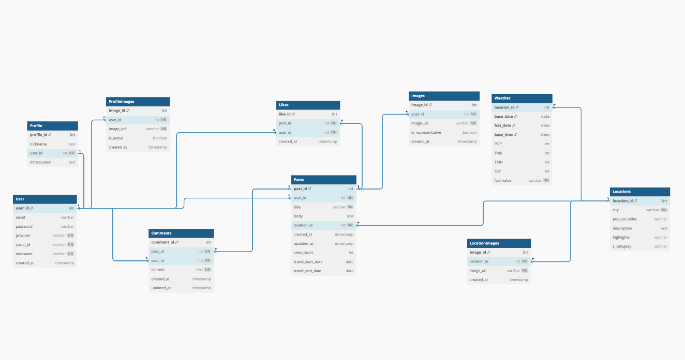
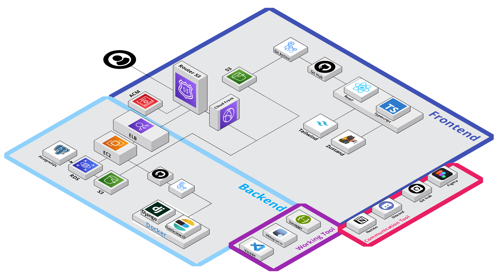

# 한바퀴  - 당신의 여행 이야기를 나누는 공간
```
한바퀴는 사용자들이 자신의 여행 경험을 공유하고, 다른 사용자들과 소통하며 여행 정보를 얻을 수 있는 커뮤니티 기반 서비스입니다.
```


<a href="https://hits.seeyoufarm.com"></a>


## Project Tech Stack

## Programming Language

## Web Framework

## REST API Framework

## Database

## ORM

## Search Engine

## Cloud Services


## Authentication

## API Documentation

## Web Scraping


## Synchronous Tasks

## Other Libraries


## Member
| Profile Image                                                                 | Name           | Role                | GitHub Profile                                     |
|-------------------------------------------------------------------------------|----------------|---------------------|----------------------------------------------------|
|   | Yoonju   | Backend Manager     | [@yoonju977](https://github.com/yoonju977)         |
|  | LSY310 | Backend Developer  | [@LSY310](https://github.com/LSY310)               |
|   | Siangit | Backend Developer | [@siangit](https://github.com/siangit)             |

## Flow Chart


## ERD


## Architecture


## API List
[API 문서 링크](https://api.hancycle.site/redoc/)

## 주요 기능:

- **게시글 작성 및 공유**: 사진, 동영상, 글 등 다양한 형태의 게시물을 작성하고 공유할 수 있습니다.
- **지역 기반 정보**: 여행 지역에 대한 상세 정보 (날씨, 인기 명소, 추천 여행 코스 등)를 제공합니다.
- **사용자 맞춤 기능**: 사용자의 관심 지역 및 좋아요한 게시물 보기를 통해 나의 여행의 계획에 필요한 정보를 수집할 수 있습니다. 
- **댓글 및 좋아요**: 게시글에 댓글을 달고 좋아요를 표시하여 다른 사용자와 소통할 수 있습니다.
- **검색 기능**: 원하는 지역이나 키워드로 게시글을 검색할 수 있습니다.
- **프로필 커스텀기능**: 여러분의 개성에 맞게 프로필을 수정해보세요!

## 앱별 기능 설명:

| 앱 이름  | 기능 설명                           |
| -------- | ----------------------------------- |
| users    | 회원 관리: 회원가입, 로그인, 프로필 수정 등 |
| boards   | 게시글 관리: 게시글 작성, 수정, 삭제, 조회, 이미지 업로드 등 |
| locations| 지역 정보 관리: 지역 정보 조회, 지역별 게시글 필터링, 날씨 정보 연동 등 |
| profiles | 회원가입한 사용자의 닉네임, 사진 수정 및 좋아요한 컨텐츠 보기  |
| weather  | 날씨 정보 관리: 기상청 API를 통해 날씨 정보 수집 및 제공 |
| search   | 검색 기능: Elasticsearch 기반 게시글 검색 기능 제공 |
